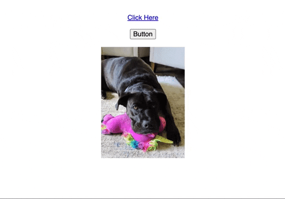

# iPad Inspired Mouse Pointer on Web with CSS Variables

I remember when iPad first added support for mouse. My first thought was, "_... why?_", but once I <a href="https://developer.apple.com/videos/play/wwdc2020/10640" target="_blank" rel="nofollow">saw it in action</a> I was mesmerized by the design. I loved the way that the cursor took the form of a shaded circle instead of the default mouse pointer, and the way the cursor interacted with buttons and links. Ever since then I wanted to create that effect for web using CSS and Javascript. I finally got the chance when coding my new website and it turned out to be pretty easy and very satisfying.

My design was heavily inspired by the functionality of <a href="https://pavellaptev.github.io/context-cursor/" target="_blank">Pavel Laptev's Context Cursor</a>, but I wanted the challenge of creating this myself, so I kept a blind eye to their source code.

**I knew I wanted to accomplish 3 things:**

1. Replace the default cursor with a translucent circle
2. Have that circle resize to highlight clickable areas
3. Make is feel good

## Getting Started

**First thing was to remove the default cursor.** This is the easy part. Simply adding `cursor: none;` to the entire html document took care of that. Easy peasy.

**Next was to display the shaded circle.** I added a `mousemove` event listener and updated css variables for the cursor's coordinates. This worked really well. Here's what we have so far:


<div class="text-xs -mb-5">HTML</div>

```
<div id="cursor"></div>
```

<div class="text-xs -mb-5">CSS</div>

```
html {
  cursor: none;
}

#cursor {
    position: fixed;
    left: var(--cursor-left);
    top: var(--cursor-top);
    width: 20px;
    height: 20px;
    margin-left: -10px;
    margin-top: -10px;
    background: rgba(0, 0, 0, 0.1);
    border-radius: 10px;
    pointer-events: none;
}
```

<div class="text-sm text-gray-600 -mt-4">1. Adding <span class="text-pink-500">pointer-events: none;</span> to the cursor element ensures that it doesn't get between the actual (hidden) cursor and what we're trying to click.</div>

<div class="text-xs mt-5 -mb-5">Javascript</div>

```
addEventListener("mousemove", function (event) {
    var documentStyle = document.documentElement.style;
    documentStyle.setProperty("--cursor-left", `${left}px`);
    documentStyle.setProperty("--cursor-top", `${top}px`);
});
```

## Getting Interactive

My main goal was to have the cursor's position and shape encapsulate whatever you hover on. I added a `mousemove` event listener to all anchor tags and buttons on the page and updated the `--cursor-left` and `--cursor-top` vars. I also set 2 new vars for the target's width and height.

So far the cursor was centered using a left and top margin of `-10px` to offset the hard-set width and height of `20px`. Also the border radius was set to `50%` to make it a perfect circle. In order to have the cursor match the shape of the target, I needed to update the border radius and margin too. I achieved this in one swoop using a new padding var. It's used to set the cursor's padding and border radius, and is part of a calculation for the negative margins.

Here's where we're at now:


<div class="text-xs mt-5 -mb-5">HTML</div>

```
<div id="cursor"></div>

<a href="#">Click Here</a>
<br/ ><br/ >
<button>Submit</button>
<br/ ><br/ >
<a href="#"></a>
```

<div class="text-xs mt-5 -mb-5">CSS</div>

```
html {
  cursor: none;
}

img, a {
  display: inline-block;
}

#cursor {
  position: fixed;
  left: var(--cursor-left);
  top: var(--cursor-top);
  width: var(--cursor-width);
  height: var(--cursor-height);
  padding: var(--cursor-padding);
  margin-left: calc(var(--cursor-padding) / -1);
  margin-top: calc(var(--cursor-padding) / -1);
  border-radius: var(--cursor-padding);
  background: rgba(0, 0, 0, 0.1);
  pointer-events: none;
}
```

<div class="text-sm text-gray-600 -mt-4">1. Setting the display property of the <span class="text-pink-500">img</span> and <span class="text-pink-500">a</span> tags on the page helps the cursor resize to the correct dimensions.</div>

<div class="text-xs mt-5 -mb-5">Javascript</div>

```
addEventListener("mousemove", function (event) {
    var documentStyle = document.documentElement.style;
    documentStyle.setProperty("--cursor-left", `${left}px`);
    documentStyle.setProperty("--cursor-top", `${top}px`);
});

for (var anchor of document.querySelectorAll("a")) {
    anchor.addEventListener("mousemove", function (event) {
        event.stopPropagation();

        var documentStyle = document.documentElement.style;
        var rect = event.currentTarget.getBoundingClientRect();

        documentStyle.setProperty("--cursor-left", `${rect.left}px`);
        documentStyle.setProperty("--cursor-top", `${rect.top}px`);
        documentStyle.setProperty("--cursor-width", `${rect.width}px`);
        documentStyle.setProperty("--cursor-height", `${rect.height}px`);
        documentStyle.setProperty("--cursor-padding", "5px");
    });
}
```

<div class="text-sm text-gray-600 -mt-4">1. The use of <span class="text-pink-500">stopPropagation</span> ensures that our other <span class="text-pink-500">mousemove</span> doesn't fire when hovering over a link or button.</div>

<div class="text-sm text-gray-600">2. <span class="text-pink-500">getBoundingClientRect</span> is an easy way to get an elements size and position in relation to the viewport.</div>

## This is going really well

OK, so the default cursor is hidden, _check_. The new cursor follows the mouse, _check_. The cursor reacts with clickable elements on the page and matches their size and position, _check_.

Now that the cursor takes the shape of the hover target, I wanted to add transitions between the default state and the hover state. Seems simple enough. I added a catchall CSS transition that will handle changes to the cursor's left, top, width, height, padding, and border radius. I set the timing function of the transition using a cubic-bezier curve to give it a little elasticity.

I loved the effect of the transitions, but I felt it would work best to have an indicator of the mouse's actual position too. So I used the `:before` pseudo class to set another cursor element using the same left and top vars. This one does not resize or transition and disappears when hovering to show the default pointer cursor.

Lastly, a funny effect was happening when scrolling where the cursor's hover state would stay put but the clickable element would scroll out from under it. To fix this I started tracking the mouse's position in javascript and shrink and reposition the cursor back to the mouse's position on scroll.

After some quick cleanup and combining some redundant code into an `updateCursorStyle` function. We are all set.

Here's the final result!



<div class="text-xs mt-5 -mb-5">HTML</div>

```
<div id="cursor"></div>

<div style="text-align: center;">
<br/ ><br/ >
<a href="#">Click Here</a>
<br/ ><br/ >
<button>Button</button>
<br/ ><br/ >
<a href="#"></a>
</div>
```

<div class="text-xs mt-5 -mb-5">CSS</div>

```
html {
  cursor: none;
}

img, a {
  display: inline-block;
}

#cursor {
  position: fixed;
  left: var(--cursor-left);
  top: var(--cursor-top);
  width: var(--cursor-width);
  height: var(--cursor-height);
  padding: var(--cursor-padding);
  margin-left: calc(var(--cursor-padding) / -1);
  margin-top: calc(var(--cursor-padding) / -1);
  border-radius: var(--cursor-padding);
  background: rgba(0, 0, 0, 0.1);
  pointer-events: none;
  transition-duration: 300ms;
  transition-timing-function: cubic-bezier(0.175, 1.275, 0.32, 1.275);
}
#cursor::before {
  position: fixed;
  left: var(--cursor-left);
  top: var(--cursor-top);
  width: 8px;
  height: 8px;
  margin-left: -4px;
  margin-top: -4px;
  border-radius: 50%;
  background: #000;
  opacity: var(--cursor-inner-opacity);
  pointer-events: none;
  content: '';
}
```

<div class="text-sm text-gray-600 -mt-4">1. The <span class="text-pink-500">::before</span> element won't appear unless <span class="text-pink-500">content: '';</span> is set.</div>

<div class="text-xs mt-5 -mb-5">Javascript</div>

```
var mouseX = 0,
  mouseY = 0;

addEventListener("mousemove", function (event) {
  mouseX = event.clientX;
  mouseY = event.clientY;
  updateCursorStyle(mouseX, mouseY, 0, 0, 20, false);
});

addEventListener("scroll", function (event) {
  updateCursorStyle(mouseX, mouseY, 0, 0, 20, false);
});

for (var anchor of document.querySelectorAll("a, button")) {
  anchor.addEventListener("mousemove", function (event) {
    event.stopPropagation();
    cursorX = event.clientX;
    cursorY = event.clientY;

    var rect = event.currentTarget.getBoundingClientRect();
    updateCursorStyle(rect.left, rect.top, rect.width, rect.height, 5, true);
  });
}

function updateCursorStyle(left, top, width, height, padding, hover) {
  var documentStyle = document.documentElement.style;
  documentStyle.setProperty("--cursor-left", `${left}px`);
  documentStyle.setProperty("--cursor-top", `${top}px`);
  documentStyle.setProperty("--cursor-width", `${width}px`);
  documentStyle.setProperty("--cursor-height", `${height}px`);
  documentStyle.setProperty("--cursor-padding", `${padding}px`);
  documentStyle.setProperty("--cursor-inner-opacity", hover ? 0 : 1);
}
```

## A Good Starting Point

This ended up being a really simple and fun proof of concept. It's a great jumping off point if you wanted to create a similar effect yourself. To be honest I tweaked this a bit more before including in on my site, and I'll probably continue to tweak it in the future.

I encourage you to try making this effect yourself, or take a copy of it and customize it to fit your needs. I really enjoyed working on it and love the end result.

You can check out the CodePen for this exercise here <a href="https://codepen.io/mattpeterse/pen/mdjmBYv" target="_blank" rel="nofollow">iPad Style Mouse Pointer on Web with CSS Variables</a>
